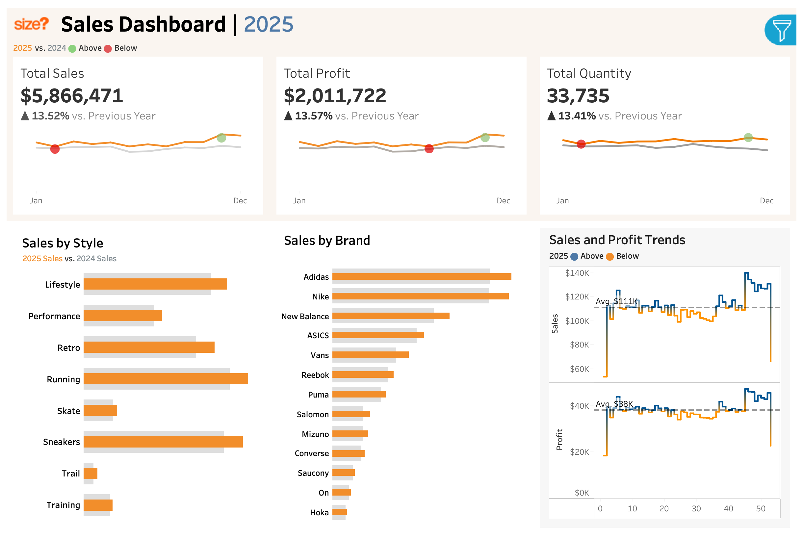

# Footwear Sales Analytics Dashboard (2015 to 2025)

[View the live dashboard on Tableau Public](https://public.tableau.com/app/profile/lux)

## About the Data
This dashboard is modelled on retail sales data I worked with at JD Sports / size?, where I built reporting across 100+ stores in 12 markets covering sell-through, margin and store-level KPIs. The figures shown here are generated rather than actual company financials, for confidentiality reasons. The schema, category structure, brand mix and metric definitions mirror how a footwear retailer actually reports, so the analysis and the decisions it points to are representative of the real thing.

## The Findings

Every dollar of 2025 growth came from selling more units, not from selling better ones.

Sales rose 13.52% year over year. Units rose 13.41%. Profit rose 13.57%. Those three numbers landing within 0.16 points of each other isn't a coincidence, it's the whole story. Average selling price moved from $173.73 to $173.90, a change of one tenth of one percent. Gross margin sat at 34.28% in 2024 and 34.29% in 2025.

So the business grew 13% and its unit economics didn't move at all. No pricing power, no mix improvement, no margin expansion. Just more shoes out the door at the same price and the same profitability.



## What I'd Recommend

**Test price, because a year of 13% volume growth found no ceiling.**<br>

If demand absorbed 13.41% more units without any upward pressure on price, price isn't currently what's constraining growth. Running and Sneakers are the two largest style categories and both grew year over year, which makes them the lowest-risk place to test a modest increase. A 2% lift on those two alone would drop straight to margin, since nothing in the data suggests volume is price-sensitive at current levels.

**Question whether thirteen brands are earning their place.**<br>

Adidas and Nike lead clearly. Below them the portfolio is remarkably flat, with Salomon, Mizuno, Converse, Saucony, On and Hoka all clustered within a narrow band of each other. Six brands delivering near-identical revenue means six supplier relationships, six inventory positions and six sets of working capital tied up for undifferentiated return. I'd look at consolidating the tail and reallocating that shelf space and buying budget toward the categories that are actually growing.

**Don't read the first and last weeks of the trend chart as performance.**<br>

The weekly sales and profit series drops sharply at both ends, well below the $111K weekly sales average and $38K weekly profit average that hold across the rest of the year. Those are partial reporting periods, not a collapse. Any year-over-year comparison that includes them will understate the real trend, which is exactly the kind of artifact that becomes a wrong decision if nobody checks the period boundaries.

## The Evidence

### Growth is entirely volume

| Metric | 2025 | Change vs 2024 | 2024 implied |
|---|---|---|---|
| Total sales | $5,866,471 | +13.52% | $5,167,786 |
| Total profit | $2,011,722 | +13.57% | $1,771,350 |
| Units sold | 33,735 | +13.41% | 29,746 |
| Avg selling price | $173.90 | +0.10% | $173.73 |
| Gross margin | 34.29% | +0.01pt | 34.28% |

The last two rows are the ones that matter. They're derived from the three headline figures rather than shown on the dashboard directly, and they're what turns "we grew 13%" into "we grew 13% and learned nothing about our pricing."

### Category performance

All eight style categories grew year over year. Running and Sneakers are the largest by revenue, followed by Lifestyle and Retro. Skate and Trail are the smallest and grew least. Nothing in the mix shifted enough to move blended price, which is consistent with the flat average selling price.

### Brand concentration

Adidas and Nike sit clearly ahead of the field. New Balance and ASICS form a second tier. From Vans downward through Reebok, Puma, Salomon, Mizuno, Converse, Saucony, On and Hoka, the spread narrows considerably and the bottom six are close to indistinguishable in revenue terms.

### Weekly rhythm

Sales average $111K per week and profit averages $38K per week across the year, tracking each other closely. That consistency is another way of seeing the flat-margin story: profit isn't decoupling from revenue in either direction.

### Scope

- 200,000+ transactions across 27 retail locations
- 30,000 unique customers
- 2015 to 2025, covering the UK, Europe and Canada
- Eight style categories and thirteen brands

## Dashboard Features

| View | What it answers |
|---|---|
| KPI cards | Sales, profit and quantity with year-over-year comparison and trend lines |
| Sales by style | Which categories customers are buying, 2025 against 2024 |
| Sales by brand | Relative brand performance across the portfolio |
| Sales and profit trends | Week-by-week performance against the annual average |
| Interactive filters | Brand, product model, footwear type, colorway, country |

## How I Built It

I generated the transaction data in Python with pandas and numpy against a schema modelled on real footwear retail reporting, then used MySQL for schema management, validation and type correction. The cleaned data is modelled into a relational structure joining orders, products, customers and locations, with year-over-year and week-over-week calculated fields on top. The Tableau dashboard sits on that model.

```
Footwear-Sales-Dashboard/
├── data/
│   ├── Orders_cleaned.csv.zip
│   ├── Customers2.csv
│   ├── Products2.csv
│   └── Locations2.csv
├── scripts/
│   └── Order Cleaning Queries.sql
├── tableau/
│   └── Footwear Sales Dashboard.twbx
├── visuals/
│   └── dashboard_preview.png
└── README.md
```

## Tech Stack

- **Python** (pandas, numpy) for dataset generation
- **MySQL** for cleaning, schema management, validation and type correction
- **Tableau Public** for dashboard design and delivery

## What I'd Do Next

- Add profit by brand to the dashboard, since merchandising decisions turn on margin rather than revenue and the current view only shows the latter
- Add a returns and refunds dataset so margin reflects net rather than gross
- Move data preparation into an automated pipeline instead of running it by hand

## Author

Lux Yogasegaran<br>
Data Engineer, Toronto<br>
[LinkedIn](https://linkedin.com/in/luxyoga) | [GitHub](https://github.com/luxyoga) | [Portfolio](https://lux-data.vercel.app)
